# python_labs

## 1 задание
```python
name=input()
age=int(input())
print(f"Привет {name}! Через год тебе будет {age+1}.")
```

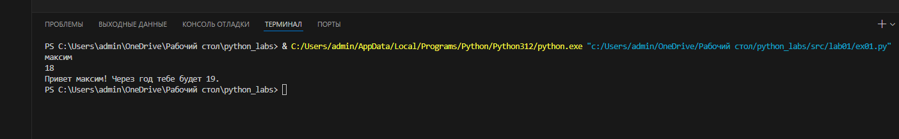

## 2 задание
``` python
a=input()
b=input()
a=a.replace(",",".",1)
b=b.replace(",",".",1)
a=float(a)
b=float(b)
sum=a+b
avg=(a+b)/2
print(f"{sum:.2f}")
print(f"{avg:.2f}")
```
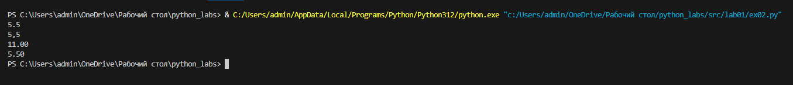

## 3 задание

```python
price=float(input())
discount=float(input())
vat=float(input())
base = price * (1 - discount/100)
vat_amount = base * (vat/100)
total = base + vat_amount
print("База после скидки:",f"{base:.2f} ₽")
print("НДС:",f"{vat_amount:.2f} ₽")
print("Итого к оплате:",f"{total:.2f} ₽")
```
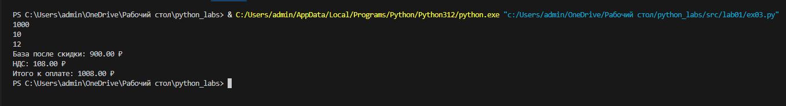
## 4 задание
```python
minut=int(input())
hour=minut//60
minut=minut-(60*hour)
print(f"{hour}:{minut}")
```

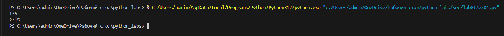


# 5 задание

```python
FIO=input()
k=0
b=[]
c=[]
x=[]
t=len(FIO)
for i in FIO:
    if i==" ":
        k=k+1
if k!=2:
    t=t-k+2
a=FIO.split(None)
b.append(a[0])
c.append(a[1])
x.append(a[2])
q=b[0]
w=c[0]
e=x[0]
print("Инициалы:",q[0],w[0],e[0],sep="")
print("Длина символов:",t)
```
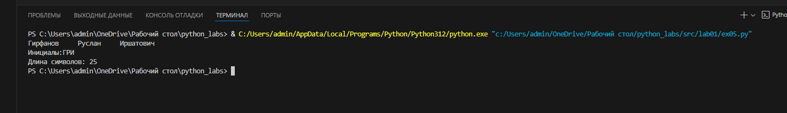

# 6 задание
```python
print("Введите число учащихся:")
n=int(input())
k=0
c=0
for a in range(n):
    print("А теперь введите фамилию, имя, возраст, и формат обучения: False ot True")
    s=input()
    d=s.split()
    forma=d[3]
    if forma=="True":
        k=k+1
    else:
        c=c+1
print(f"Очный:{k} Заочный:{c}")
```
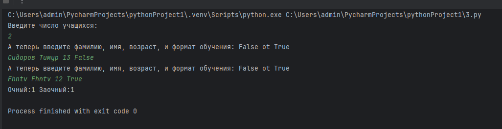


# Лабораторная работа №2
## Задание 1
```python
def min_max(nums: list[float | int]):
    if not nums:
        raise ValueError
    else:
        min_val = min(nums)
        max_val = max(nums)
        return (min_val,max_val)
print(min_max([3, -1, 5, 5, 0]))
print(min_max([42]))
print(min_max([-5, -2, -9]))
print(min_max([1.5,2,2.0,-3.1]))
print(min_max([]))
```
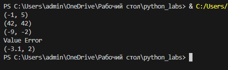
## Задание 2
```python
def unique_sorted(nums: list[float | int]):
    return (list(sorted(set(nums))))
print(unique_sorted([3, 1, 2, 1, 3]))
print(unique_sorted([]))
print(unique_sorted([-1, -1, 0, 2, 2]))
print(unique_sorted([1.0, 1, 2.5, 2.5, 0]))
```
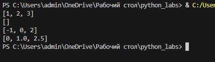

## Задание 3
```python
def flatten(mat: list[list | tuple]):
    flattened_list = []
    for row in mat:
        if isinstance(row, (list, tuple)):
            flattened_list.extend(row)
        else:
            raise TypeError
    return (flattened_list)
print(flatten([[1, 2], [3, 4]]))
print(flatten([[1, 2], (3, 4, 5)]))
print(flatten([[1], [],[2, 3]]))
print(flatten([[1, 2], "ab"]))
```
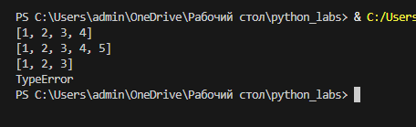

## Задание 4
```python
def transpose(mat: list[list[float | int]]):
    if not mat:
        return []
    rows=len(mat)
    cols=len(mat[0])
    for row in mat:
        if len(row)!=cols:
            raise ValueError
    teleport_mat = [[mat[i][j] for i in range(rows)] for j in range(cols)]
    return teleport_mat
print(transpose([[1, 2, 3]]))
print(transpose([[1],[2], [3]]))
print(transpose([[1,2],[3,4]]))
print(transpose([[1,2],[3]]))
print(transpose([[]]))
```
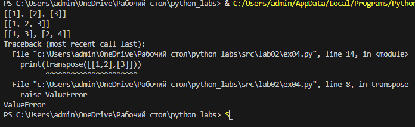

## Задание 5
```python
def row_sums(mat: list[list[float | int]]):
    if not mat:
        return []
    rows = len(mat)
    cols = len(mat[0])
    for row in mat:
        if len(row) != cols:
            raise ValueError
    sums=[sum(row) for row in mat]
    return sums
print(row_sums([[1,2,3], [4,5,6]]))
print(row_sums([[-1, 1], [10, -10]]))
print(row_sums([[0,0], [0,0]]))
print(row_sums([[1,2], [3]]))
```
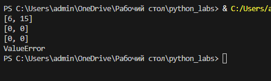

## Задание 6
```python
def col_sums(mat: list[list[float | int]]):
    if not mat:
        return []
    rows = len(mat)
    cols = len(mat[0])
    for row in mat:
        if len(row) != cols:
            raise ValueError
    sums = [sum(mat[i][j] for i in range(rows)) for j in range(cols)]
    return sums
print(col_sums([[1, 2, 3], [4, 5, 6]]))
print(col_sums([[-1, 1], [10, -10]]))
print(col_sums([[0, 0], [0, 0]]))
print(col_sums([[1, 2], [3]]))
```
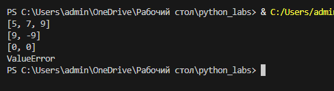

## Задание 7
```python
def format_record(rec: tuple[str, str, float]):
    fio, group, gpa = rec
    if not isinstance(fio, str) or not fio.strip():
        raise ValueError("ФИО должно быть непустой строкой.")
    if not isinstance(group, str) or not group.strip():
        raise ValueError("Группа должна быть непустой строкой.")
    if not isinstance(gpa, (int, float)):
        raise ValueError("GPA должно быть числом.")
    parts = fio.strip().split()
    family = parts[0]
    family=(family.title())
    initials = ""
    for part in parts[1:]:
        initials += part[0].upper() + "."
    if not initials:
        initials = ""
    form_gpa=f"{gpa:.2f}"
    return f"{family} {initials}, гр. {group}, GPA {form_gpa}"
print(format_record((34141, "BIVT-25", 4.6)))
print(format_record(("Петров Пётр", "IKBO-12", 5.0)))
print(format_record(("Петров Пётр Петрович", "IKBO-12", 5.0)))
print(format_record(("Петров Пётр Петрович", "IKBO-12", 5.0)))
print(format_record(("  сидорова  анна   сергеевна ", "ABB-01", 3.999)))

```
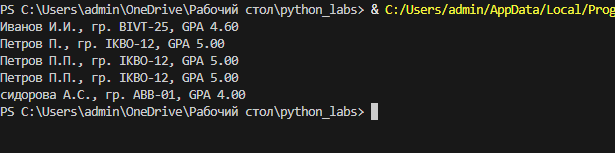

# Лабораторная работа №4

## Код программы

- **[io_txt_csv.py](src/lab04/io_txt_csv.py)** - модуль для работы с файлами
- **[text_report.py](src/lab04/text_report.py)** - скрипт генерации отчетов

## Запуск
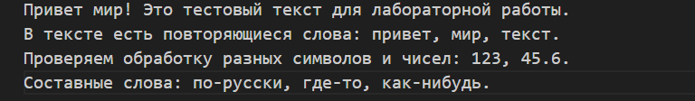
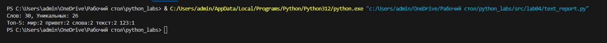
## Кодировки файлов

- **По умолчанию:** UTF-8
- **Для других кодировок:** 
  ```python
  read_text("file.txt", encoding="cp1251")  # Windows-1251
  read_text("file.txt", encoding="koi8-r")  # KOI8-R


# 🔹 [Лабораторная работа 5: Конвертация форматов данных](/src/lab05/README.md)
- **JSON ↔ CSV** - взаимная конвертация между структурированными и табличными данными
- **CSV → XLSX** - экспорт табличных данных в Excel формат
- **Валидация данных** - обработка ошибок и проверка целостности
- **Автоформатирование** - автоматическая настройка ширины колонок в Excel


####  Основные возможности:
- Поддержка русского языка (UTF-8 кодировка)
- Автоматическое создание директорий
- Информативные сообщения об ошибках
- Алфавитный порядок колонок в CSV

# Кликай сюда
[Вся инфа про лабу 5](src/lab05/README.md)