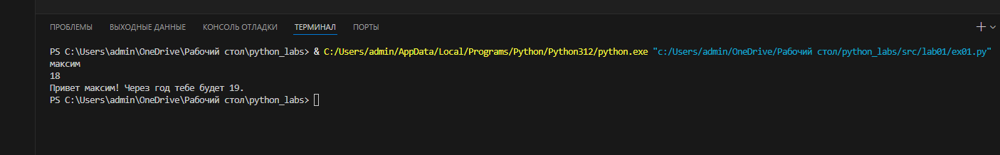

<div align="center">

# ✨ **Вы смотрите мою первую лабу!** ✨

</div>

## 1 задание
```python
name=input()
age=int(input())
print(f"Привет {name}! Через год тебе будет {age+1}.")
```


## 2 задание
``` python
a=input()
b=input()
a=a.replace(",",".",1)
b=b.replace(",",".",1)
a=float(a)
b=float(b)
sum=a+b
avg=(a+b)/2
print(f"{sum:.2f}")
print(f"{avg:.2f}")
```


## 3 задание

```python
price=float(input())
discount=float(input())
vat=float(input())
base = price * (1 - discount/100)
vat_amount = base * (vat/100)
total = base + vat_amount
print("База после скидки:",f"{base:.2f} ₽")
print("НДС:",f"{vat_amount:.2f} ₽")
print("Итого к оплате:",f"{total:.2f} ₽")
```

## 4 задание
```python
minut=int(input())
hour=minut//60
minut=minut-(60*hour)
print(f"{hour}:{minut}")
```


# 5 задание

```python
FIO=input()
k=0
b=[]
c=[]
x=[]
t=len(FIO)
for i in FIO:
    if i==" ":
        k=k+1
if k!=2:
    t=t-k+2
a=FIO.split(None)
b.append(a[0])
c.append(a[1])
x.append(a[2])
q=b[0]
w=c[0]
e=x[0]
print("Инициалы:",q[0],w[0],e[0],sep="")
print("Длина символов:",t)
```


# 6 задание
```python
print("Введите число учащихся:")
n=int(input())
k=0
c=0
for a in range(n):
    print("А теперь введите фамилию, имя, возраст, и формат обучения: False ot True")
    s=input()
    d=s.split()
    forma=d[3]
    if forma=="True":
        k=k+1
    else:
        c=c+1
print(f"Очный:{k} Заочный:{c}")
```


