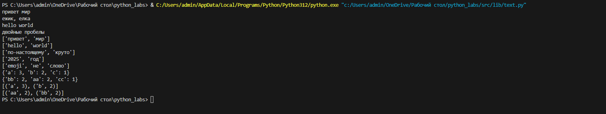
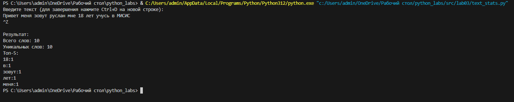

<div align="center">

# ✨ **Вы смотрите мою третью лабу!** ✨

</div>

### Задание А
```py
def normalize(text: str, *, casefold: bool = True, yo2e: bool = True) -> str:
    if text is None:
        raise ValueError
    if not isinstance(text, str):
        raise TypeError
    if len(text) == 0:
        return ""  
    if yo2e:
        text = text.replace('Ё', 'Е').replace('ё', 'е')
    if casefold:
        text = text.casefold()
    text = text.replace('\t', ' ')    # табуляция
    text = text.replace('\r', ' ')    # возврат каретки  
    text = text.replace('\n', ' ')    # новая строка
    text = ' '.join(text.split())
    text= text.strip()
    return text
```
```py
import re
def tokenize(text: str) -> list[str]:
    return re.findall(r"\w+(?:-\w+)*", text)
```
```py
def count_freq(tokens: list[str]) -> dict[str, int]:
    if not tokens:
        return {}
    freq_dict = {}
    for token in tokens:
        freq_dict[token] = freq_dict.get(token, 0) + 1
    return freq_dict
```
``` py
def top_n(freq: dict[str, int], n: int = 5) -> list[tuple[str, int]]:
    if not freq:
        return []
    items = list(freq.items())
    items.sort(key=lambda x: x[0])           # Сортировка по слову A→Z
    items.sort(key=lambda x: x[1], reverse=True)  # Сортировка по частоте 9→0
    return items[:n]
```
## Тест кейсы

``` py
print(normalize("ПрИвЕт\nМИр\t"))
print(normalize("ёжик, Ёлка")) 
print(normalize("Hello\r\nWorld"))
print(normalize("  двойные   пробелы  "))

print(tokenize("привет мир" ))
print(tokenize("hello,world!!!"))
print(tokenize("по-настоящему круто"))
print(tokenize("2025 год" ))
print(tokenize("emoji 😀 не слово" ))

print(count_freq(["a","b","a","c","b","a"]))
print(count_freq(["bb", "aa", "bb", "aa", "cc"]))

freq1 = {"a": 3, "b": 2, "c": 1}
print(top_n(freq1, 2))
freq2 = {"bb": 2, "aa": 2, "cc": 1}
print(top_n(freq2, 2))
```


## Задание B
```py
#!/usr/bin/env python3
import sys
import os

# Добавляем путь к корневой папке проекта
sys.path.append(os.path.join(os.path.dirname(__file__), '..'))

from lib.text import normalize, tokenize, count_freq, top_n

def main():
    print("Введите текст (для завершения нажмите Ctrl+D на новой строке):")
    
    # Читаем весь ввод из stdin
    text = sys.stdin.read()
    
    if not text.strip():
        print("Вы не ввели текст!")
        return
    
    # Нормализуем текст
    normalized_text = normalize(text, casefold=True, yo2e=True)
    
    # Токенизируем
    tokens = tokenize(normalized_text)
    
    # Подсчитываем статистику
    total_words = len(tokens)
    unique_words = len(set(tokens))
    
    # Частоты и топ-5
    freq = count_freq(tokens)
    top_words = top_n(freq, 5)
    
    # Вывод результатов
    print("\nРезультат:")
    print(f"Всего слов: {total_words}")
    print(f"Уникальных слов: {unique_words}")
    print("Топ-5:")
    for word, count in top_words:
        print(f"{word}:{count}")

if __name__ == "__main__":
    main()
```
