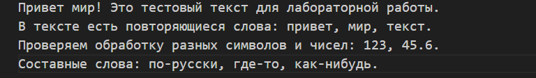

<div align="center">

# ✨ **Вы смотрите мою четвертую лабу!** ✨

</div>

## Код программы

- **[io_txt_csv.py](src/lab04/io_txt_csv.py)** - модуль для работы с файлами
- **[text_report.py](src/lab04/text_report.py)** - скрипт генерации отчетов

## Запуск


## Кодировки файлов

- **По умолчанию:** UTF-8
- **Для других кодировок:** 
  ```python
  read_text("file.txt", encoding="cp1251")  # Windows-1251
  read_text("file.txt", encoding="koi8-r")  # KOI8-R
