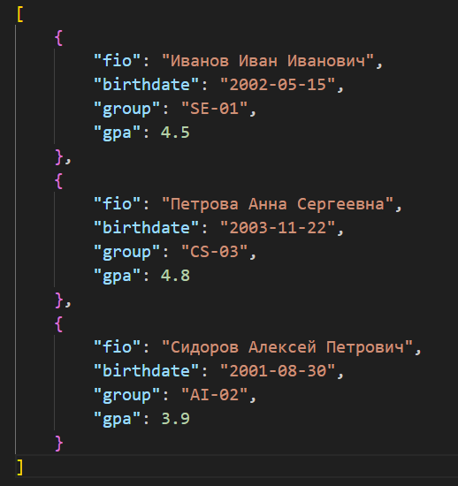
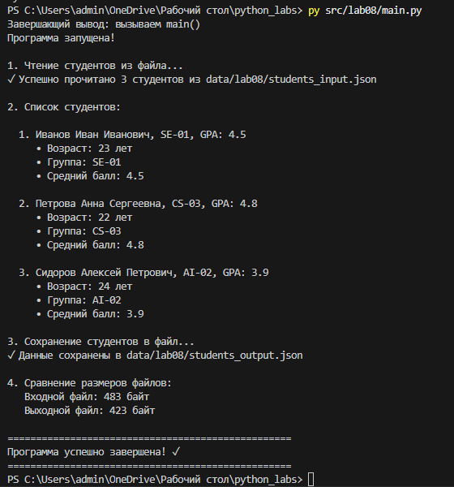
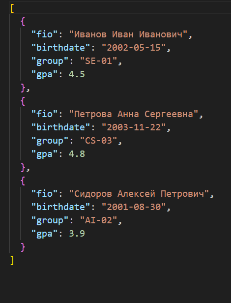

<div align="center">


# ✨ **Вы смотрите мою восьмую лабу!** ✨

</div>

## 🔗 Ссылки на файлы проекта

### 📁 Исходный код
`src/lab08/models.py` - модель данных для студента с использованием `@dataclass`  
`src/lab08/serialize.py` - функции сериализации и десериализации студентов в JSON  
`src/lab08/main.py` - основной файл для выполнения программы  
`data/lab08/students_input.json` - пример входного JSON с данными студентов  
`data/lab08/students_output.json` - пример выходного JSON после сериализации студентов  


## Описание структуры класса `Student` и логики его методов

Класс `Student` представляет собой модель данных студента, включающую поля:
- ФИО студента
- Дата рождения
- Группа
- Средний балл (GPA)

Методы класса включают:
- **`age()`** — метод для вычисления возраста студента на основе даты рождения.
- **`to_dict()`** — метод для сериализации объекта в словарь.
- **`from_dict()`** — метод для десериализации из словаря.
- **`__str__()`** — метод для красивого вывода информации о студенте.

Валидация данных включает проверку формата даты и диапазона GPA.

## Логика работы класса `Student`

### Автоматическая генерация методов

Декоратор `@dataclass` автоматически генерирует несколько методов для класса:

1. **`__init__()`**: Метод инициализации объекта, который автоматически создается на основе полей, определенных в классе. Он принимает значения для всех атрибутов (`fio`, `birthdate`, `group`, `gpa`) и создает объект.

2. **`__repr__()`**: Этот метод автоматически генерируется и предоставляет строковое представление объекта, которое удобно для вывода в консоль.

3. **`__eq__()`**: Метод для сравнения двух объектов класса `Student` на основе их атрибутов. Два студента считаются равными, если их все атрибуты совпадают.


## Мой файл data/lab_08/students_input.json

## Запуск файла main.ru
```bash
py src/lab08/main.py
```
## Вывод в терминале 

## После выполнения программы, был создан файл students_output.json




---

## Заключение

Лабораторная работа 8 демонстрирует использование **ООП** и **декоратора `@dataclass`** для создания классов данных, а также работу с **сериализацией** и **десериализацией** объектов в JSON. Реализованы методы для работы с данными студентов, включая вычисление возраста и валидацию данных.
