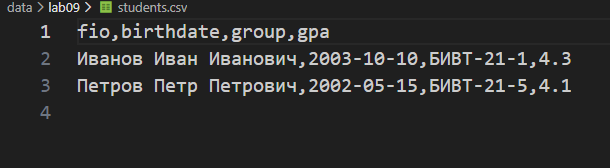

<div align="center">

# 📊 **Вы смотрите мою девятую лабу!** 📊

</div>

## 🔗 Ссылки на файлы проекта

### 📁 Исходный код
`src/lab09/group.py` - класс `Group` с реализацией CRUD-операций для работы с CSV  
`src/lab09/__init__.py` - файл инициализации пакета lab09  
`src/lab09/main.py` - демонстрационная программа тестирования CRUD-операций  
`data/lab09/students.csv` - база данных студентов в формате CSV  

## Описание структуры класса `Group` и логики его методов

Класс `Group` представляет собой менеджер для работы с хранилищем данных студентов в формате CSV. Файл используется как простая база данных с поддержкой CRUD-операций.

### Основные методы класса:

- **`__init__(storage_path)`** — инициализация объекта с указанием пути к CSV-файлу
- **`list()`** — получение списка всех студентов (операция Read)
- **`add(student)`** — добавление нового студента в хранилище (операция Create)
- **`find(substr)`** — поиск студентов по подстроке в ФИО
- **`update(fio, **fields)`** — обновление данных существующего студента (операция Update)
- **`remove(fio)`** — удаление студента из хранилища (операция Delete)

### Вспомогательные методы:

- **`_ensure_storage_exists()`** — создание файла с заголовками, если он не существует
- **`_read_all()`** — чтение всех записей из CSV-файла
- **`_write_all(students)`** — запись всех студентов в CSV-файл

## Структура CSV-файла

Файл `students.csv` имеет следующую структуру:



## Запуск тестера(main.py)
```bash
py src/lab09/main.py
```
# Вывод:


## Заключение
Лабораторная работа 9 демонстрирует реализацию CRUD-операций для работы с данными, хранящимися в CSV-файле. Класс Group предоставляет удобный интерфейс для управления студентами, включая добавление, чтение, обновление и удаление записей. Работа показывает интеграцию с классом Student из предыдущей лабораторной работы и использование модуля csv для сериализации и десериализации данных.

